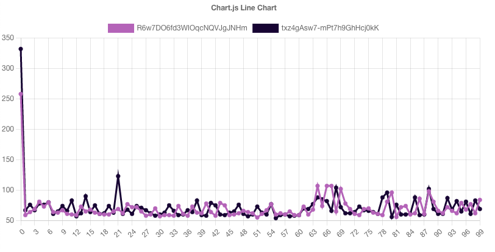
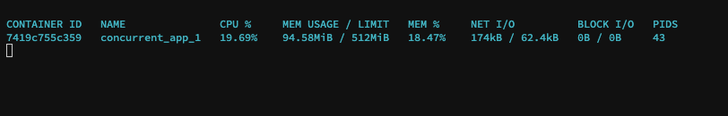
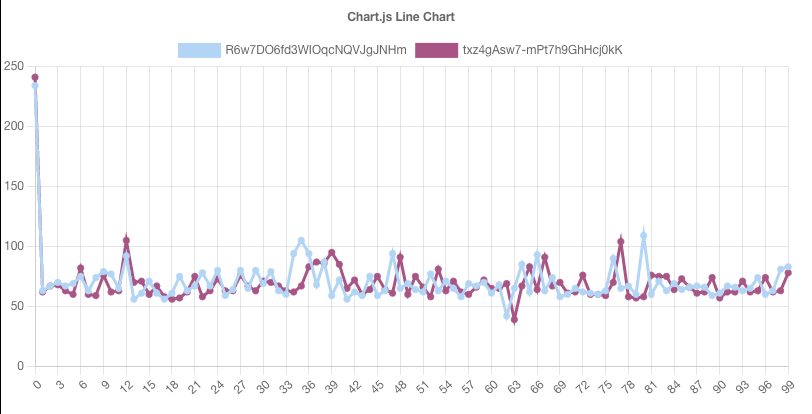
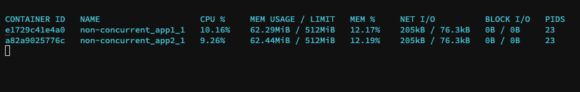

# ST-17055
Demonstrate how to use two clients `concurrently` and `consecutively` in a docker environment with limited container resources.

## Docker specifications

```ts
NodeJs Image: node:16.0.0
CPUs: 0.5
Memory: 512m

// see docker-compose file
```

## Setup Instructions

- Ensure `docker` and `docker-compose` are both installed and running on host machine
- Create a `.env` file in the root directory
- Enter the following values into the created `.env` file 

```bash
#.env
CTP_PROJECT_KEY=

CTP_CLIENT_ID_1=
CTP_CLIENT_SECRET_1=

CTP_CLIENT_ID_2=
CTP_CLIENT_SECRET_2=
```

## Usage Instruction

### Concurrent execution
- Navigate into the `concurrent` directory
- Run `docker-compose up`

### Consecutive execution 
- Navigate into the `non-concurrent` directory
- Run `docker-compose up`


## Client statistics
- Look into the `.data` directory for the stats of the finished execution


## Visualize the stats
- Open the `index.html` file in your favourite web browser and select the `.json` stats files in the `.data` directory
- Stats files are located in the `.data` directory contained within the `concurrent` and `non-concurrent` directory respectively.

_Note that these files (with filenames corresponding to project `clientId`) are mounted from the container hence will only be available after a successfully `docker-compose up` command execution_

## Screenshots

_concurrent_





<!-- _stats_ -->


_consecutive_





<!-- _stats_ -->
